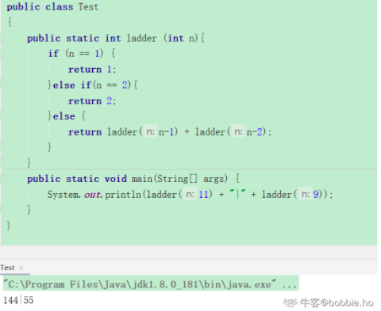
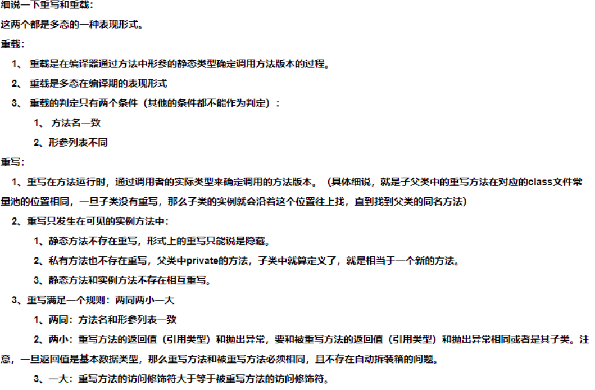
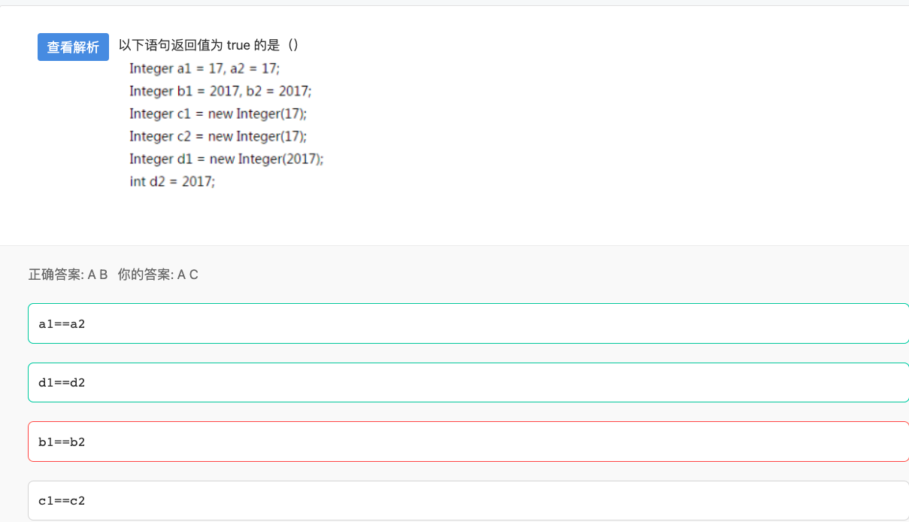
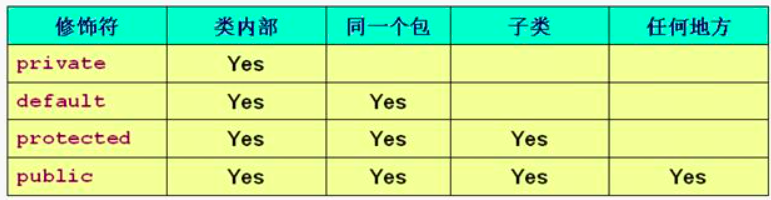
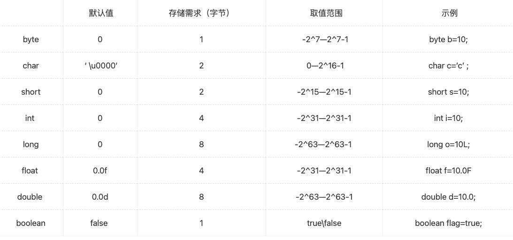
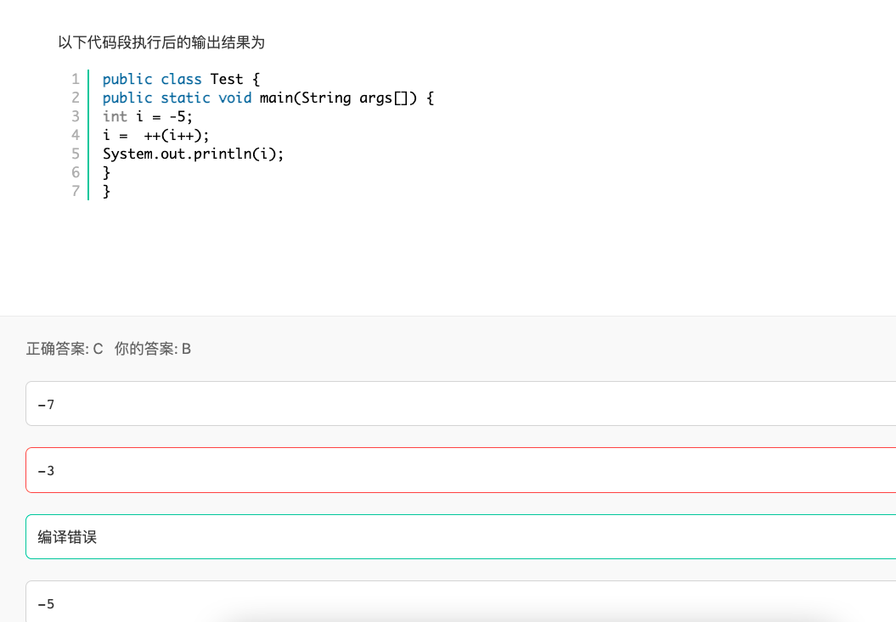
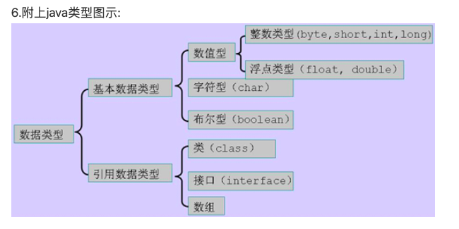
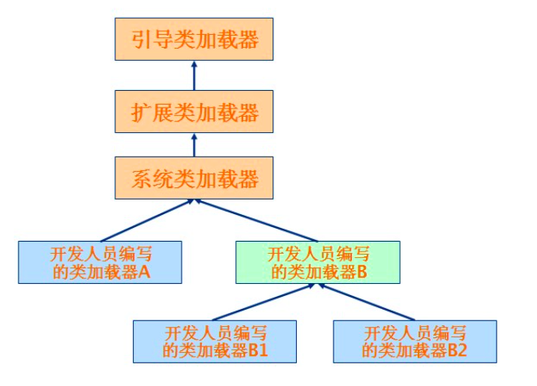

### 错题总结

### 1.Java的跨平台特性

是因为JVM的存在， 它可以执行.class字节码文件，而不是.java源代码

### 2.各种流

```java
节点流：
FileInputStream，FileOutputStrean，FileReader，FileWriter
StringReader，StringWriter

ByteArrayInputStream ，ByteArrayOutputStream ，CharArrayReader

PipedInputStream PipedOutputStream PipedReaderPipedWriter

处理流：
BufferedInputStrean，BufferedOutputStream，BufferedReader，BufferedWriter 
InputStreamReader，OutputStreamReader

DataInputStream，DataOutputStream

PrintWriter
```

**节点流**的前缀都是名词，如File，String，Char等；**处理流**的前缀都是动词，如input，print，bufferd等等

### 3. 爬楼梯算法

在你面前有一个n阶的楼梯，你一步只能上1阶或2阶。请问，当N=11时，你可以采用多少种不同的方式爬完这个楼梯（）；当N=9时呢？



### 4.Unicode的基础知识

在Java语言中，下列关于字符集编码（Character set encoding）和国际化（i18n）的问题，哪些是正确的？

```
Java的char类型，通常以UTF-16 Big Endian的方式保存一个字符。
实现国际化应用常用的手段是利用ResourceBundle类
```

### 5.下面哪个行为被打断不会导致InterruptedException：（ ）？

抛InterruptedException的代表方法有：

- java.lang.Object 类的 wait 方法
- java.lang.Thread 类的 sleep 方法
- java.lang.Thread 类的 join 方法

### 6.JSP分页代码中，哪个步骤次序是正确的？

```
先取总记录数，得到总页数，最后显示本页的数据。
```

### 7. Math.floor(-8.5)=( )

```
(double)-9.0
floor: 求小于参数的最大整数。返回double类型-----n. 地板，地面
         例如：Math.floor(-4.2) = -5.0
-----------------------------------------------------------
ceil:   求大于参数的最小整数。返回double类型-----vt. 装天花板；
         例如：Math.ceil(5.6) = 6.0
-----------------------------------------------------------
round: 对小数进行四舍五入后的结果。返回int类型
         例如：Math.round(-4.6) = -5
```

### 8. 抽象类和接口（为特殊的抽象类）

```java
接口是一种特殊的抽象类，先说明抽象类中的抽象方法，再说明接口

抽象类中的抽象方法(其前有 abstract1修饰)不能用 private、 static、 synchronized、na
tive访回修饰符修饰。原因如下:
1. private
抽象方法没有方法体,是用来被继承的,所以不能用 private修饰;
2.static
static修饰的方法可以通过类名来访间该方法(即该方法的方法体),抽象方法用sttic修饰没有意义;
3. synchronized
该关键字是为该方法加一个锁。而如果该关键字修饰的方法是 static方法。则使用的锁就是class变量的锁。如果是修饰类方法。则用this变量锁。
但是抽象类不能实例化对象,因为该方法不是在该抽象类中实现的。是在其子类实现的。所以，锁应该归其子类所有。所以，抽象方法也就不能用 synchronized关键字修饰了;
3. native
native这个东西本身就和 abstract冲突,他们都是方法的声明,只是一个把方法实现移交给子类,另一个是移交给本地操作系统。如果同时出现,就相当于即把实现移交给子类,又把实现移交给本地操作系统,那到底谁来实现具体方法呢

终于说到了接口！
接口是一种特殊的抽象类,接口中的方法全部是抽象方法(但其前的 abstract可以省略),所以抽象类中的抽象方法不能用的访间修饰符这里也不能用。同时额外说明一下protect关键词
4. protect
protected访同修饰符也不能使用,因为接口可以让所有的类去实现(非继承),不只是其子类,但是要用public去修饰。接口可以去继承一个已有的接口。
```

### 9.静态方法不能在main中引用

```java
当类加载时，static静态方法随着类加载而初始化，此时实例对象还未被创建，但是非静态成员变量需要等到实例对象创建才会被初始化，故无法被引用。
```

### 10. 重写和重载



### 11.  jvm的垃圾回收算法

```
两个最基本的java回收算法：复制算法和标记清理算法
复制算法：两个区域A和B，初始对象在A，继续存活的对象被转移到B。此为新生代最常用的算法
标记清理：一块区域，标记可达对象（可达性分析），然后回收不可达对象，会出现碎片，那么引出
标记-整理算法：多了碎片整理，整理出更大的内存放更大的对象
两个概念：新生代和年老代
新生代：初始对象，生命周期短的
永久代：长时间存在的对象
整个java的垃圾回收是新生代和年老代的协作，这种叫做分代回收。
P.S：Serial New收集器是针对新生代的收集器，采用的是复制算法
Parallel New（并行）收集器，新生代采用复制算法，老年代采用标记整理
Parallel Scavenge（并行）收集器，针对新生代，采用复制收集算法
Serial Old（串行）收集器，新生代采用复制，老年代采用标记整理
Parallel Old（并行）收集器，针对老年代，标记整理
CMS收集器，基于标记清理
G1收集器：整体上是基于标记 整理 ，局部采用复制

综上：新生代基本采用复制算法，老年代采用标记整理算法。cms采用标记清理。

```

### 12. 类是线程安全的

```java
难道我们只能单纯的背java的那个类是线程安全的，那个类不是线程安全的么？
这和授人以鱼有何区别呢？难道就没有一种方法授人以渔？直接教我们如何去判断一个类是否是线程安全的？
java中的线程安全是什么：
就是线程同步的意思，就是当一个程序对一个线程安全的方法或者语句进行访问的时候，其他的不能再对他进行操作了，必须等到这次访问结束以后才能对这个线程安全的方法进行访问
什么叫线程安全：
如果你的代码所在的进程中有多个线程在同时运行，而这些线程可能会同时运行这段代码。如果每次运行结果和单线程运行的结果是一样的，而且其他的变量的值也和预期的是一样的，就是线程安全的。
或者说:一个类或者程序所提供的接口对于线程来说是原子操作或者多个线程之间的切换不会导致该接口的执行结果存在二义性,也就是说我们不用考虑同步的问题。
线程安全问题都是由全局变量及静态变量引起的。
若每个线程中对全局变量、静态变量只有读操作，而无写操作，一般来说，这个全局变量是线程安全的；若有多个线程同时执行写操作，一般都需要考虑线程同步，否则就可能影响线程安全。
看过vector源码的同学就会知道他的许多操作都是加了synchronized修饰的比如他的添加元素。(不知道synchronized是什么意思的自行百度！)

public synchronized void addElement(E obj) {  modCount++;
       ensureCapacityHelper(elementCount + 1);  elementData[elementCount++] = obj;
}
而HashMap的所有操作都没有加synchronized修饰 ，不如他的put源码

public V put(K key, V value) {
     if (key == null)
         return
      putForNullKey(value);
      int hash = hash(key.hashCode());
      int i = indexFor(hash, table.length);
      for(Entry<K,V> e = table[i]; e != null; e = e.next) {
         Object k;
         if (e.hash == hash &&((k = e.key) == key || key.equals(k))) {
             V oldValue = e.value;
             e.value = value;
             e.recordAccess(this);
             return
             oldValue;    }
     }
     modCount++;
     addEntry(hash, key, value, i);
     return null;
 }
再看看ArrayList的add方法的源码

public boolean add(E e) {
     ensureCapacity(size + 1);  // Increments modCount!!
     elementData[size++] = e;
     return true;
 }
再看StringBuffer的append源码，他是有synchronized修饰的

public synchronized
  StringBuffer append(String str) {
     super.append(str);
     return this;
 }
最后是Properties的setProperty方法，他是有synchronized修饰的

public synchronized
  Object setProperty(String key, String value) {
      return
      put(key, value);
 }
由此就可以判断出谁是线程安全的了。
```

### 13.下列哪些操作会使线程释放锁资源？

```java
1.sleep()方法

在指定时间内让当前正在执行的线程暂停执行，但不会释放“锁标志”。不推荐使用。

sleep()使当前线程进入阻塞状态，在指定时间内不会执行。

2.wait()方法

在其他线程调用对象的notify或notifyAll方法前，导致当前线程等待。线程会释放掉它所占有的“锁标志”，从而使别的线程有机会抢占该锁。

当前线程必须拥有当前对象锁。如果当前线程不是此锁的拥有者，会抛出IllegalMonitorStateException异常。

唤醒当前对象锁的等待线程使用notify或notifyAll方法，也必须拥有相同的对象锁，否则也会抛出IllegalMonitorStateException异常。

waite()和notify()必须在synchronized函数或synchronized　block中进行调用。如果在non-synchronized函数或non-synchronized　block中进行调用，虽然能编译通过，但在运行时会发生IllegalMonitorStateException的异常。

3.yield方法

暂停当前正在执行的线程对象。

yield()只是使当前线程重新回到可执行状态，所以执行yield()的线程有可能在进入到可执行状态后马上又被执行。

yield()只能使同优先级或更高优先级的线程有执行的机会。 

        4.join方法
join()等待该线程终止。
等待调用join方法的线程结束，再继续执行。如：t.join();//主要用于等待t线程运行结束，若无此句，main则会执行完毕，导致结果不可预测
```

```java
刚看到一个大佬写的，给大家参考一下
所谓的释放锁资源实际是通知对象内置的monitor对象进行释放，而只有所有对象都有内置的monitor对象才能实现任何对象的锁资源都可以释放。又因为所有类都继承自Object，所以wait(）就成了Object方法，也就是通过wait()来通知对象内置的monitor对象释放，而且事实上因为这涉及对硬件底层的操作，所以wait()方法是native方法，底层是用C写的。
其他都是Thread所有，所以其他3个是没有资格释放资源的
而join()有资格释放资源其实是通过调用wait()来实现的
代码如下： 
wait()方法   
    public final native void wait(long timeoutMillis) throws InterruptedException;
 
join()方法
public final synchronized void join(long millis)
    throws InterruptedException {
        long base = System.currentTimeMillis();
        long now = 0;
 
        if (millis < 0) {
            throw new IllegalArgumentException("timeout value is negative");
        }
 
        if (millis == 0) {
            while (isAlive()) {
                wait(0);
            }
        } else {
            while (isAlive()) {
                long delay = millis - now;
                if (delay <= 0) {
                    break;
                }
                wait(delay);
                now = System.currentTimeMillis() - base;
            }
        }
    }
```

### 14.对于线程局部存储TLS(thread local storage)，以下表述正确的是

 ThreadLocal可以给一个初始值，而每个线程都会获得这个初始化值的一个副本，这样才能保证不同的线程都有一份拷贝。ThreadLocal 不是用于解决共享变量的问题的，不是为了协调线程同步而存在，而是为了方便每个线程处理自己的状态而引入的一个机制.

### 15. 假如某个JAVA进程的JVM参数配置如下：
-Xms1G -Xmx2G -Xmn500M -XX:MaxPermSize=64M -XX:+UseConcMarkSweepGC -XX:SurvivorRatio=3,
请问eden区最终分配的大小是多少？

```java
Xms 起始内存

Xmx 最大内存

Xmn 新生代内存

Xss 栈大小。 就是创建线程后，分配给每一个线程的内存大小

-XX:NewRatio=n:设置年轻代和年老代的比值。如:为3，表示年轻代与年老代比值为1：3，年轻代占整个年轻代年老代和的1/4

-XX:SurvivorRatio=n:年轻代中Eden区与两个Survivor区的比值。注意Survivor区有两个。如：3，表示Eden：Survivor=3：2，一个Survivor区占整个年轻代的1/5

-XX:MaxPermSize=n:设置持久代大小

收集器设置
-XX:+UseSerialGC:设置串行收集器
-XX:+UseParallelGC:设置并行收集器
-XX:+UseParalledlOldGC:设置并行年老代收集器
-XX:+UseConcMarkSweepGC:设置并发收集器
垃圾回收统计信息
-XX:+PrintGC
-XX:+PrintGCDetails
-XX:+PrintGCTimeStamps
-Xloggc:filename
并行收集器设置
-XX:ParallelGCThreads=n:设置并行收集器收集时使用的CPU数。并行收集线程数。
-XX:MaxGCPauseMillis=n:设置并行收集最大暂停时间
-XX:GCTimeRatio=n:设置垃圾回收时间占程序运行时间的百分比。公式为1/(1+n)
并发收集器设置
-XX:+CMSIncrementalMode:设置为增量模式。适用于单CPU情况。
-XX:ParallelGCThreads=n:设置并发收集器年轻代收集方式为并行收集时，使用的CPU数。并行收集线程数。
```

### 16.Servlet的生命周期分

```java
Servlet的生命周期分为5个阶段：加载、创建、初始化、处理客户请求、卸载。
(1)加载：容器通过类加载器使用servlet类对应的文件加载servlet
(2)创建：通过调用servlet构造函数创建一个servlet对象
(3)初始化：调用init方法初始化
(4)处理客户请求：每当有一个客户请求，容器会创建一个线程来处理客户请求
(5)卸载：调用destroy方法让servlet自己释放其占用的资源
```

### 17 设int x=1,float y=2,则表达式x/y的值是：（）

```java
本题的意义在于两点，明白这两点之后题会不会本身就不重要了：①float x = 1；与float x = 1.0f，这两种对于float类型的变量来说定义的方式都是正确的，也是比较常见的笔试题里面考察类型转换的例子，当第一种情况时，是将低精度int向上转型到float，是由于java的特性导致而不需要进行强制转换，而第二种情况则是比较正式的对于float变量的定义，由于这种类型本身在工作项目中并不常见，常用的带小数的数字我们一般都直接使用double类型，而double类型直接定义是没有问题的：double x = 1.0。而由于float的精度没有double类型高，因此必须对其进行显示的格式书写，如果没有这个f，就默认是double类型了。当然double x = 1.0d也是正确的命名，不信你可以尝试，虽然这是一个令人窒息的操作。②当多个精度的数字同时进行运算时，最终结果以最高精度为准。在多数情况下，整数和小数的各级混合运算中，一般结果都是double类型的。但就本题而言，结果是float类型的，因为x，y两个数字精度最高的就是float，所以最终结果是0.5，并且这个0.5是float类型的。为什么说不是double类型呢，当然如果你这样处理：double m = x/y，当然m是double类型的，也不会报错，而如果你写成int m = x/y，编译器报错提示的时候就会让你转换成float或者进行强制转换成int，他是不会提示你转换成double的，尽管这么写并没有报错，原因就是①
中所说的向上强转。float转换成double不需要任何提示。
```

### 18.类方法和实例方法

```
在类方法中调用本类的类方法可直接调用。 实例方法也叫做对象方法。

类方法是属于整个类的，而实例方法是属于类的某个对象的。
由于类方法是属于整个类的，并不属于类的哪个对象，所以类方法的方法体中不能有与类的对象有关的内容。即类方法体有如下限制： 
(1) 类方法中不能引用对象变量；
(2) 类方法中不能调用类的对象方法；
(3) 在类方法中不能使用super、this关键字。
(4)类方法不能被覆盖。 
如果违反这些限制，就会导致程序编译错误。
与类方法相比，对象方法几乎没有什么限制：
(1) 对象方法中可以引用对象变量，也可以引用类变量；
(2) 对象方法中可以调用类方法；
(3) 对象方法中可以使用super、this关键字。
```

### 19.变量的声明

类中声明的变量有默认初始值；方法中声明的变量没有默认初始值，必须在定义时初始化，否则在访问该变量时会出错。

boolean类型默认值是false

### 20.冒泡排序

**假设一个 list初始化为{2，9，5，4，8，1}。 在第一次冒泡排序后，list变成了（）?**

冒泡排序是相邻之间两两交换，第一次排序后，最大值在末尾，中间两两交换结果为：2 5 4 8 1 9

### 21.重载/重写

```java
重载就是一句话：同名不同参，返回值无关。

覆盖/重写：同名同参
```

### 22.局部变量和成员变量

java采用局部优先的思想。局部变量可以和成员变量相同，使用标识符调用时，优先使用局部变量。在实例方法中出现变量名相同时，可以使用this关键字来调用。

### 23.创建对象

```java
Java有5种方式来创建对象： 
1、使用 new 关键字（最常用）： ObjectName obj = new ObjectName(); 
2、使用反射的Class类的newInstance()方法： ObjectName obj = ObjectName.class.newInstance(); 
3、使用反射的Constructor类的newInstance()方法： ObjectName obj = ObjectName.class.getConstructor.newInstance(); 
4、使用对象克隆clone()方法： ObjectName obj = obj.clone(); 
5、使用反序列化（ObjectInputStream）的readObject()方法： try (ObjectInputStream ois = new ObjectInputStream(new FileInputStream(FILE_NAME))) { ObjectName obj = ois.readObject(); }

```

### 24.synchronized关键字和volatile关键字比较：

**synchronized: 具有原子性，有序性和可见性**；（三个都有）
**volatile：具有有序性和可见性（缺一个原子性）**

```java
volatile关键字是线程同步的轻量级实现，所以volatile性能肯定比synchronized关键字要好。但是volatile关键字只能用于变量而synchronized关键字可以修饰方法以及代码块。synchronized关键字在JavaSE1.6之后进行了主要包括为了减少获得锁和释放锁带来的性能消耗而引入的偏向锁和轻量级锁以及其它各种优化之后执行效率有了显著提升，实际开发中使用 synchronized 关键字的场景还是更多一些。
多线程访问volatile关键字不会发生阻塞，而synchronized关键字可能会发生阻塞
volatile关键字能保证数据的可见性，但不能保证数据的原子性。synchronized关键字两者都能保证。
volatile关键字主要用于解决变量在多个线程之间的可见性，而 synchronized关键字解决的是多个线程之间访问资源的同步性。
```

### 25. **精度丢失只会发生在从大范围到小范围的转换**

### 26.AOP和OOP的区别

```java
1. 面向方面编程 AOP 偏重业务处理过程的某个步骤或阶段，强调降低模块之间的耦合度，使代码拥有更好的移植性。
2. 面向对象编程 (oop) 则是对业务分析中抽取的实体进行方法和属性的封装。
也可以说 AOP 是面向业务中的动词领域， OOP 面向名词领域。
AOP 的一个很重要的特点是源代码无关性，也就是说如果我们的系统中引用了 AOP 组件，即使我们把该组件去掉，系统代码也应该能够编译通过。要实现这一点，可以使用动态 proxy 模式。
```

### 27. Collection 接口常用的方法

```java
size():返回集合中元素的个数
add(Object obj):向集合中添加一个元素
addAll(Colletion coll):将形参coll包含的所有元素添加到当前集合中
isEmpty():判断这个集合是否为空
clear():清空集合元素
contains(Object obj):判断集合中是否包含指定的obj元素
① 判断的依据：根据元素所在类的equals()方法进行判断
②明确：如果存入集合中的元素是自定义的类对象，要去：自定义类要重写equals()方法
constainsAll(Collection coll):判断当前集合中是否包含coll的所有元素
rentainAll(Collection coll):求当前集合与coll的共有集合，返回给当前集合
remove(Object obj):删除集合中obj元素，若删除成功，返回ture否则
removeAll(Collection coll):从当前集合中删除包含coll的元素
equals(Object obj):判断集合中的所有元素 是否相同
hashCode():返回集合的哈希值
toArray(T[] a):将集合转化为数组
①如有参数，返回数组的运行时类型与指定数组的运行时类型相同。
iterator():返回一个Iterator接口实现类的对象,进而实现集合的遍历。
数组转换为集合：Arrays.asList(数组)
```

### 28.线程方法与锁

```java
1.sleep()方法
在指定时间内让当前正在执行的线程暂停执行，但不会释放“锁标志”。不推荐使用。
sleep()使当前线程进入阻塞状态，在指定时间内不会执行。
2.wait()方法
在其他线程调用对象的notify或notifyAll方法前，导致当前线程等待。线程会释放掉它所占有的“锁标志”，从而使别的线程有机会抢占该锁。
当前线程必须拥有当前对象锁。如果当前线程不是此锁的拥有者，会抛出IllegalMonitorStateException异常。
唤醒当前对象锁的等待线程使用notify或notifyAll方法，也必须拥有相同的对象锁，否则也会抛出IllegalMonitorStateException异常。
waite()和notify()必须在synchronized函数或synchronized　block中进行调用。如果在non-synchronized函数或non-synchronized　block中进行调用，虽然能编译通过，但在运行时会发生IllegalMonitorStateException的异常。
3.yield方法 
暂停当前正在执行的线程对象。
yield()只是使当前线程重新回到可执行状态，所以执行yield()的线程有可能在进入到可执行状态后马上又被执行。
yield()只能使同优先级或更高优先级的线程有执行的机会。 
4.join方法
等待该线程终止。
等待调用join方法的线程结束，再继续执行。如：t.join();//主要用于等待t线程运行结束，若无此句，main则会执行完毕，导致结果不可预测。

```

### 29.java8中，下面哪个类用到了解决哈希冲突的开放定址法

```java
ThreadLocalMap中使用开放地址法来处理散列冲突，而HashMap中使用的是分离链表法。之所以采用不同的方式主要是因为：在ThreadLocalMap中的散列值分散得十分均匀，很少会出现冲突。并且ThreadLocalMap经常需要清除无用的对象，使用纯数组更加方便。
```

### 30.类的初始化过程也就是方法执行的过程。

```java
父类的静态域-子类的静态域 父类的非静态域-父类的构造函数 子类的非静态域-子类的构造函数 规律就是 父类先于子类 静态的先于非静态的
其中静态域包含静态代码块与静态方法，这个谁在前面，则先执行谁。
非静态域同理
```

### 31.**Java中的volatile关键字的功能**

```java
volatile是java中的一个类型修饰符。它是被设计用来修饰被不同线程访问和修改的变量。如果不加入volatile，基本上会导致这样的结果：要么无法编写多线程程序，要么编译器 失去大量优化的机会。
1，可见性
    可见性指的是在一个线程中对该变量的修改会马上由工作内存（Work Memory）写回主内存（Main Memory），所以会马上反应在其它线程的读取操作中。顺便一提，工作内存和主内存可以近似理解为实际电脑中的高速缓存和主存，工作内存是线程独享的，主存是线程共享的。
2，禁止指令重排序优化
    禁止指令重排序优化。大家知道我们写的代码（尤其是多线程代码），由于编译器优化，在实际执行的时候可能与我们编写的顺序不同。编译器只保证程序执行结果与源代码相同，却不保证实际指令的顺序与源代码相同。这在单线程看起来没什么问题，然而一旦引入多线程，这种乱序就可能导致严重问题。volatile关键字就可以从语义上解决这个问题。
    注意，禁止指令重排优化这条语义直到jdk1.5以后才能正确工作。此前的JDK中即使将变量声明为volatile也无法完全避免重排序所导致的问题。所以，在jdk1.5版本前，双重检查锁形式的单例模式是无法保证线程安全的。因此，下面的单例模式的代码，在JDK1.5之前是不能保证线程安全的。
```

### 32.多态的表现形式有

多态的表现形式可以是对父类的方法的重写

### 33. HashMap的理解

```java
1.HashMap的底层是由数组加链表实现的，对于每一个key值，都需要计算哈希值，然后通过哈希值来确定顺序，并不是按照加入顺序来存放的，因此可以认为是无序的，但不管是有序还是无序，它都一个自己的顺序。
2.最开始有Hashtable，Hashtable是不允许key和value的值为空的，但后来开发者认为有时候也会有key值为空的情况，因为可以允许null为空，通过查看HashMap的源代码就知道：if(key = null) {putForNullKey(value);};
3.Map底层都是用key/value键值对的形式存放的
4.哈希表结构:在JDK1.8以后, 如果同一个地址上存储元素小于8个,是数组加链表结构.
如果同一个地址上存储元素大于8个,是数组加红黑树结构.
```

### 34.关于运行时常量池

```java
运行时常量池（Runtime Constant Pool）是方法区的一部分。Class文件中除了有类的版本、字段、方法、接口等描述信息外，
常量池（Constant Pool Table），用于存放编译器生成的各种字面量和符号引用，这部分内容将在类加载后进入方法区的运行时常量池中存放。
```

### 35.有关hashMap跟hashTable的区别

```java
①继承不同。public class Hashtable extends Dictionary implements Map public class HashMap extends AbstractMap implements Map
②Hashtable 中的方法是同步的，而HashMap中的方法在缺省情况下是非同步的。在多线程并发的环境下，可以直接使用Hashtable，但是要使用HashMap的话就要自己增加同步处理了。
③Hashtable中，key和value都不允许出现null值。
在HashMap中，null可以作为键，这样的键只有一个；可以有一个或多个键所对应的值为null。当get()方法返回null值时，即可以表示 HashMap中没有该键，也可以表示该键所对应的值为null。因此，在HashMap中不能由get()方法来判断HashMap中是否存在某个键， 而应该用containsKey()方法来判断。
④两个遍历方式的内部实现上不同。Hashtable、HashMap都使用了 Iterator。而由于历史原因，Hashtable还使用了Enumeration的方式 。
⑤哈希值的使用不同，HashTable直接使用对象的hashCode。而HashMap重新计算hash值。
⑥Hashtable和HashMap它们两个内部实现方式的数组的初始大小和扩容的方式。HashTable中hash数组默认大小是11，增加的方式是 old*2+1。HashMap中hash数组的默认大小是16，而且一定是2的指数。 
```

### 36.volatile的功能

**volatile到底做了什么:**

```java
禁止了指令重排
保证了不同线程对这个变量进行操作时的可见性，即一个线程修改了某个变量值，这个新值对其他线程是立即可见的
不保证原子性（线程不安全）
```

**synchronized关键字和volatile关键字比较：**

```java
volatile关键字是线程同步的轻量级实现，所以volatile性能肯定比synchronized关键字要好。但是volatile关键字只能用于变量而synchronized关键字可以修饰方法以及代码块。synchronized关键字在JavaSE1.6之后进行了主要包括为了减少获得锁和释放锁带来的性能消耗而引入的偏向锁和轻量级锁以及其它各种优化之后执行效率有了显著提升，实际开发中使用 synchronized 关键字的场景还是更多一些。
多线程访问volatile关键字不会发生阻塞，而synchronized关键字可能会发生阻塞
volatile关键字能保证数据的可见性，但不能保证数据的原子性。synchronized关键字两者都能保证。
volatile关键字主要用于解决变量在多个线程之间的可见性，而 synchronized关键字解决的是多个线程之间访问资源的同步性。
```

### 37.线程安全的类

线程安全的类有hashtable concurrentHashMap synchronizedMap

```java
java.util.concurrent.ConcurrentHashMap 线程安全
java.util.Map 接口
java.util.TreeMap
java.util.SortedMap 接口
java.util.Hashtable 线程安全
java.util.HashMap
```

### 38 Java语言提供了修饰符

```java
访问权限修饰符
public：共有访问。对所有的类都可见。
protected：保护型访问。对同一个包可见，对不同的包的子类可见。
default：默认访问权限。只对同一个包可见，注意对不同的包的子类不可见。
private：私有访问。只对同一个类可见，其余都不见。

非访问权限修饰符
static 修饰符，用来创建类方法和类变量。
final 修饰符，用来修饰类、方法和变量，final 修饰的类不能够被继承，修饰的方法不能被继承类重新定义，修饰的变量为常量，是不可修改的。
abstract 修饰符，用来创建抽象类和抽象方法。
synchronized 用于多线程的同步。
volatile 修饰的成员变量在每次被线程访问时，都强制从共享内存中重新读取该成员变量的值。而且，当成员变量发生变化时，会强制线程将变化值回写到共享内存。这样在任何时刻，两个不同的线程总是看到某个成员变量的同一个值。
transient：序列化的对象包含被 transient 修饰的实例变量时，java 虚拟机(JVM)跳过该特定的变量。
 
类

外部类修饰符
public（访问控制符），将一个类声明为公共类，它可以被任何对象访问，一个程序的主类必须是公共类。
default（访问控制符），类只对包内可见，包外不可见。
abstract（非访问控制符），将一个类声明为抽象类，抽象类不能用来实例化对象，声明抽象类的唯一目的是为了将来对该类进行扩充，抽象类可以包含抽象方法和非抽象方法。。
final（非访问控制符），将一个类生命为最终（即非继承类），表示它不能被其他类继承。 
  
注意： 
1.protected 和 private 不能修饰外部类，是因为外部类放在包中，只有两种可能，包可见和包不可见。 
2. final 和 abstract不能同时修饰外部类，因为该类要么能被继承要么不能被继承，二者只能选其一。 
3.不能用static修饰类，因为类加载后才会加载静态成员变量。所以不能用static修饰类和接口，因为类还没加载，无法使用static关键字。

内部类修饰符
内部类与成员变量地位一直，所以可以public,protected、default和private，同时还可以用static修饰，表示嵌套内部类，不用实例化外部类，即可调用。

方法修饰符
public（公共控制符），包外包内都可以调用该方法。
protected（保护访问控制符）指定该方法可以被它的类和子类进行访问。具体细节可参考：http://blog.csdn.net/dawn_after_dark/article/details/74453915
default(默认权限），指定该方法只对同包可见，对不同包（含不同包的子类）不可见。
private（私有控制符）指定此方法只能有自己类等方法访问，其他的类不能访问（包括子类），非常严格的控制。
final ,指定方法已完备，不能再进行继承扩充。
static，指定不需要实例化就可以激活的一个方法，即在内存中只有一份，通过类名即可调用。
synchronize，同步修饰符，在多个线程中，该修饰符用于在运行前，对它所属的方法加锁，以防止其他线程的访问，运行结束后解锁。
native，本地修饰符。指定此方法的方法体是用其他语言在程序外部编写的。
abstract ,抽象方法是一种没有任何实现的方法，该方法的的具体实现由子类提供。抽象方法不能被声明成 final 和 static。 任何继承抽象类的子类必须实现父类的所有抽象方法，除非该子类也是抽象类。 如果一个类包含若干个抽象方法，那么该类必须声明为抽象类。抽象类可以不包含抽象方法。 抽象方法的声明以分号结尾，例如：public abstract sample();。
 
成员变量修饰符
public（公共访问控制符），指定该变量为公共的，它可以被任何对象的方法访问。
protected（保护访问控制符）指定该变量可以别被自己的类和子类访问。在子类中可以覆盖此变量。
default(默认权限），指定该变量只对同包可见，对不同包（含不同包的子类）不可见。
private（私有访问控制符）指定该变量只允许自己的类的方法访问，其他任何类（包括子类）中的方法均不能访问。
final，最终修饰符，指定此变量的值不能变。
static（静态修饰符）指定变量被所有对象共享，即所有实例都可以使用该变量。变量属于这个类。
transient（过度修饰符）指定该变量是系统保留，暂无特别作用的临时性变量。不持久化。
volatile（易失修饰符）指定该变量可以同时被几个线程控制和修改，保证两个不同的线程总是看到某个成员变量的同一个值。 
 final 和 static 经常一起使用来创建常量。
 

局部变量修饰符
only final is permitted。 
        
为什么不能赋予权限修饰符？ 
因为局部变量的生命周期为一个方法的调用期间，所以没必要为其设置权限访问字段，既然你都能访问到这个方法，所以就没必要再为其方法内变量赋予访问权限，因为该变量在方法调用期间已经被加载进了虚拟机栈，换句话说就是肯定能被当前线程访问到，所以设置没意义。 

为什么不能用static修饰 
我们都知道静态变量在方法之前先加载的，所以如果在方法内设置静态变量，可想而知，方法都没加载，你能加载成功方法内的静态变量？

接口
        
接口修饰符
接口修饰符只能用public、default和abstract。 
不能用final、static修饰。
接口默认修饰为abstract。
        
接口中方法修饰符
only public & abstract are permitted 。 
意思只能用 public abstract修饰，当然如果你什么都不写，默认就是public abstract。 
注意：在Java1.8之后，接口允许定义static 静态方法了！所以也可以用static来修饰！
```

### 39.flush（）函数

flush（）函数强制将缓冲区中的字符流、字节流等输出，目的是如果输出流输出到缓冲区完成后，缓冲区并没有填满，那么缓冲区将会一直等待被填满。所以在关闭输出流之前要调用flush（）。

### 40，父类和子类执行顺序问题

**子类A继承父类B, A a = new A(); 则父类B构造函数、父类B静态代码块、父类B非静态代码块、子类A构造函数、子类A静态代码块、子类A非静态代码块 执行的先后顺序是？**

```java
正确的执行顺序是:父类Ｂ静态代码块->子类Ａ静态代码块->父类Ｂ非静态代码块->父类Ｂ构造函数->子类Ａ非静态代码块->子类Ａ构造函数
也就是说非静态初始化块的执行顺序要在构造函数之前。

class SuperClass{
private static String STR = "Super Class Static Variable";
static{
System.out.println("Super Class Static Block:"+STR);
}

public SuperClass() {
System.out.println("Super Class Constructor Method");
}
{
System.out.println("Super Class Block");
}

}
public class ObjectInit extends SuperClass{
private static String STR = "Class Static Variable";
static{
System.out.println("Class Static Block:"+STR);
}

public ObjectInit() {
System.out.println("Constructor Method");
}
{
System.out.println("Class Block");
}
public static void main(String[] args) {
@SuppressWarnings("unused")
ObjectInit a =new ObjectInit();
}
}

执行完之后可以看到顺序如下:
Super Class Static Block:Super Class Static Variable
Class Static Block:Class Static Variable
Super Class Block
Super Class Constructor Method
Class Block
Constructor Method
```

**解释原因**

```java
当实例化子类对象时，首先要加载父类的class文件进内存，静态代码块是随着类的创建而执行，所以父类静态代码块最先被执行，子类class文件再被加载，同理静态代码块被先执行；实例化子类对象要先调用父类的构造方法，而调用父类构造方法前会先执行父类的非静态代码块
```

### 41. 第六页啦

明天上午整理，，滴滴又发来了笔试通知，老子发现，简历莫得问题，就是提高基础和数据结构问题！

多刷点题，和面经，把项目做熟悉！！

然后发现，苹果系统好舒服！！比windows系统强多了！真的！

越努力，越幸运！多刷题！注重基础！比如数据结构，Java基础，因为框架啥的面试只是一题而过，因为你是个毕业生，以基础为主

### 41 循环优化

```java
强度削弱，代码外提，删除多余代码
```

### 42基本数据类型拆箱和装箱



```java
	选A、B。考察的是基本类型装箱/拆箱对象引用（内存地址）是否相同。
Integer a1=17实际上执行了Integer.valueOf(17)；
public static Integer valueOf(int i) { assert IntegerCache.high >= 127; if (i >= IntegerCache.low && i <= IntegerCache.high) return IntegerCache.***[i + (-IntegerCache.low)]; return new Integer(i);
}
选项A，a1、a2赋值给Integer类型，自动装箱。对于–128到127（默认是127）之间的值，Integer.valueOf(int i) 返回的是缓存的Integer对象（并不是新建对象），变量所指向的是同一个对象，所以a1==a2返回true。
选项B，Integer和int比较会进行自动拆箱，比较的是数值大小，所以d1==d2返回true。
选项C，由于超出自动装箱的范围，return返回的是新建的对象，所以对象内存地址不同，b1==b2返回false。
选项D，普通new创建对象，两个new创建两个地址不同的对像，所以c1==c2返回false。
```

### 43 .线程的哪些叙述是对

```java
使用start()方法可以使一个线程成为可运行的，但是它不一定立即开始运行。
当一个线程因为抢先机制而停止运行，它可能被放在可运行队列的前面。
一个线程可能因为不同的原因停止并进入就绪状态。
```

### 44.SPRING的事务传播特性

```java
Spring的API设计很不错，基本上根据英文翻译就能知道作用:Required:必须的。说明必须要有事物，没有就新建事物。supports:支持。说明仅仅是支持事务，没有事务就非事务方式执行。mandatory:强制的。说明一定要有事务，没有事务就抛出异常。required_new:必须新建事物。如果当前存在事物就挂起。not_supported:不支持事物，如果存在事物就挂起。never:绝不有事务。如果存在事物就抛出异常
```

### 45for循环流程

```
for``(初始化语句; 布尔表达式; 更新语句) {``  ``正文过程;``}
```

执行顺序:

1. 初始化语句, 仅在循环开始前执行一次;
2. 布亇表达式, 用于决定是否继续执行正文过程, 表达式中异常则结束循环;
3. 正文过程, 如果过程中存在break, return或者异常, 循环结束(不会执行更新语句), 如果遇到continue, 则会执行更新语句后进入下一轮循环;
4. 更新语句, 注意更新语句不做逻辑真假判断, 到这里一轮循环结束;
5. 布亇表达式, 进入新一轮循环;

### 46.访问权限控制



### 47.子类和父类的继承关系

```java
子类不可以继承父类的构造方法，只可以调用父类的构造方法。子类中所有的构造函数都会默认访问父类中的空参数构造函数，这是因为子类的构造函数内第一行都有默认的super（）语句。super（）表示子类在初始化时调用父类的空参数的构造函数来完成初始化。一个类都会有默认的空参数的构造函数，若指定了带参构造函数，那么默认的空参数的构造函数，就不存在了。这时如果子类的构造函数有默认的super（）语句，那么就会出现错误，因为父类中没有空参数的构造函数。因此，在子类中默认super（）语句，在父类中无对应的构造函数，必须在子类的构造函数中通过this或super（参数）指定要访问的父类中的构造函数。
```

### 48.Object 类中方法及说明

```java
registerNatives()   //私有方法
getClass()    //返回此 Object 的运行类。
hashCode()    //用于获取对象的哈希值。
equals(Object obj)     //用于确认两个对象是否“相同”。
clone()    //创建并返回此对象的一个副本。
toString()   //返回该对象的字符串表示。   
notify()    //唤醒在此对象监视器上等待的单个线程。   
notifyAll()     //唤醒在此对象监视器上等待的所有线程。   
wait(long timeout)    //在其他线程调用此对象的 notify() 方法或 notifyAll() 方法，或        者超过指定的时间量前，导致当前线程等待。   
wait(long timeout, int nanos)    //在其他线程调用此对象的 notify() 方法或 notifyAll() 方法，或者其他某个线程中断当前线程，或者已超过某个实际时间量前，导致当前线程等待。
wait()    //用于让当前线程失去操作权限，当前线程进入等待序列
finalize()    //当垃圾回收器确定不存在对该对象的更多引用时，由对象的垃圾回收器调用此方法。
```

### 49.String字符串详解和 ==与equals详解

```java
1.== 和 equals():
(1)“==” 用于比较基本数据类型时比较的是值，用于比较引用类型时比较的是引用指向的地址。
(2)Object 中的equals() 与 “==” 的作用相同，但String类重写了equals()方法，比较的是对象中的内容。
    
public boolean equals(Object anObject) {  if (this == anObject) {
      return true;    } else { if (anObject instanceof String) {
                String aString = (String)anObject;
       if (this.coder() == aString.coder()) { return this.isLatin1() ? StringLatin1.equals(this.value, aString.value) : StringUTF16.equals(this.value, aString.value); 
       }
        } return false;  }
}

2.String对象的两种创建方式:
(1)第一种方式: String str1 = "aaa";  是在常量池中获取对象("aaa" 属于字符串字面量，因此编译时期会在常量池中创建一个字符串对象，如果常量池中已经存在该字符串对象则直接引用)
(2)第二种方式: String str2 = new String("aaa") ; 一共会创建两个字符串对象一个在堆中，一个在常量池中（前提是常量池中还没有 "aaa" 象）。
        System.out.println(str1==str2);//false

3.String类型的常量池比较特殊。它的主要使用方法有两种：
(1)直接使用双引号声明出来的String对象会直接存储在常量池中。
(2)如果不是用双引号声明的String对象,可以使用 String 提供的 intern 方法。 String.intern() 是一个 Native 方法，它的作用是： 如果运行时常量池中已经包含一个等于此 String 对象内容的字符串，则返回常量池中该字符串的引用； 如果没有，则在常量池中创建与此 String 内容相同的字符串，并返回常量池中创建的字符串的引用。
    String s1 = new String("AAA");
    String s2 = s1.intern();
    String s3 = "AAA";
    System.out.println(s2);//AAA
    System.out.println(s1 == s2);//false，因为一个是堆内存中的String对象一个是常量池中的String对象，
    System.out.println(s2 == s3);//true， s1,s2指向常量池中的”AAA“
4字符串拼接：
    String a = "a";
    String b = "b";
         
    String str1 = "a" + "b";//常量池中的对象
    String str2 = a + b; //在堆上创建的新的对象     
    String str3 = "ab";//常量池中的对象
    System.out.println(str1 == str2);//false
    System.out.println(str1 == str3);//true 
    System.out.println(str2 == str3);//false
```

### 50 默认数据类型图



### 51. |和||. &和&& 的区别

```java
短路和非短路逻辑运算符一定要记清楚啊，我就记混啦。
1.|和&是非短路逻辑运算符，不管怎么样，两边都执行；
2.||和&&是短路逻辑运算符，其中逻辑运算符“||”左边为true，则右边不执行，如果左边为false，才执行右边；“&&”运算符左边为false的话，右边就不执行了，如果左边为true，才执行右边。
```


### 52.i++和++i



```java
答案是 编译错误。
这题编译错误在于这一句：  i =  ++(i++);
++（  ）  括号里面必须是一个变量，而 i ++  是一个字面量。
```

### 53.成员变量和局部变量初始化

```java
类变量在不设置初始值时，会进行默认值赋值，而局部方法中声明的变量则必须进行初始化，他不会进行默认值赋值。
```

### 54.Java中的关键字有哪些？

```java
答：1）48个关键字：abstract、assert、boolean、break、byte、case、catch、char、class、continue、default、do、double、else、enum、extends、final、finally、float、for、if、implements、import、int、interface、instanceof、long、native、new、package、private、protected、public、return、short、static、strictfp、super、switch、synchronized、this、throw、throws、transient、try、void、volatile、while。
2）2个保留字（现在没用以后可能用到作为关键字）：goto、const。
3）3个特殊直接量：true、false、null。 
```

### 55.JAVA 子类重写继承的方法

```java
JAVA 子类重写继承的方法时,不可以降低方法的访问权限，子类继承父类的访问修饰符要比父类的更大，也就是更加开放，假如我父类是protected修饰的，其子类只能是protected或者public，绝对不能是friendly(默认的访问范围)或者private，当然使用private就不是继承了。还要注意的是，继承当中子类抛出的异常必须是父类抛出的异常的子异常，或者子类抛出的异常要比父类抛出的异常要少。
```

### 56.实现线程的方式

```java
在java多线程中实现多线程的方式有两种①extends Thread ②implements Runnable。这两种情况是我们最常见的，还有一种是由第二种变形而来的直接new Runnable(){}，我们都知道java的接口是不可以实例化的，但代码中的new Runnable(){xxx}确是实例化了，为什么？ 接口和抽象类不可以实例化是对的，这个是java语法规范来的，**而new Runnable(){}其实不是实例化Runnable接口来的，实际上一种内部类的一种简写** 在这里：
①首先构造了一个”implements Runnable “的无名local内部类(方法内的内部类)
②然后构造了这个无名local内部类的一个实例
③然后用Runnable来表示这个无名local内部类的type(OO多态)。 例如上面这段代码编译后你会看到其实是编译了两个类来的，如下： 
其中Text2$1就是无名local内部内类，这个也就很好地解释了为什么在main（）方法中new Runnable(){xxx}里面的调用main()方法中的变量的时候要用final关键字来修饰
```

### 57数据类型大总结

```java
1. java数据类型分为:
        *  基本数据类型
        *  引用数据类型

2.对于"=="
        *用于基本数据类型相互比较. 比较二者的值是否相等.
        *用于引用数据类型相互比较. 比较二者地址是否相等.
        *不能用于基本数据类型与引用型比较.

3.对于"equals":
        * 不能用于基本数据类型比较(因为这是一个方法, 继承自object).
        *用于进行对象的比较, 比较二者的引用地址是否相同.

 4.特殊情况:
        1)数值型基本类型和数值型类会存在自动装箱和自动拆箱.
        2)字符串会以常量形式存在, 如果多个字符串变量值相同, 则他们指向同一个地址.
        3)数值类型会存在类型自动转换.
          
  枚举（enum）类型是Java 5新增的特性，它是一种新的类型，允许用常量来表示特定的数据片断，而且全部都以类型安全的形式来表示，是特殊的类，可以拥有成员变量和方法。	
```




### 58.被static修饰的语句或者变量有如下特点：

```java
1.随着类的加载而加载
2.优先于对象存在
3.被所有对象所共享
4.可以直接被类名所调用
使用注意：
1.静态方法只能访问静态成员
2.静态方法中不可以写this,super关键字
3.主函数是静态的
```

### 59 Java中的类加载器

```java
Java 中的类加载器大致可以分成两类，一类是系统提供的，另外一类则是由Java 应用开发人员编写的。系统提供的类加载器主要有下面三个：

引导类加载器（bootstrap class loader）：
它用来加载 Java 的核心库，是用原生代码来实现的，并不继承自 java.lang.ClassLoader。主要负责jdk_home/lib目录下的核心api 或 -Xbootclasspath 选项指定的jar包装入工作（其中的jdk_home是指配置jdk环境变量是java_home的配置路径，一般是jdk/jre所在目录）。

扩展类加载器（extensions class loader）：
它用来加载 Java 的扩展库。Java虚拟机的实现会提供一个扩展库目录，扩展类加载器在此目录里面查找并加载 Java 类，主要负责jdk_home/lib/ext目录下的jar包或 -Djava.ext.dirs 指定目录下的jar包装入工作。

系统类加载器（system class loader）：
它根据 Java 应用的类路径（CLASSPATH）来加载 Java 类。一般来说，Java 应用的类都是由它来完成加载的。可以通过 ClassLoader.getSystemClassLoader()来获取它。主要负责CLASSPATH/-Djava.class.path所指的目录下的类与jar包装入工作.

除了系统提供的类加载器以外，开发人员可以通过继承java.lang.ClassLoader类的方式实现自己的类加载器，从而进行动态加载class文件，以满足一些特殊的需求，这体现java动态实时类装入特性。

除了引导类加载器之外，所有的类加载器都有一个父类加载器，通过getParent()方法可以得到。对于系统提供的类加载器来说，系统类加载器的父类加载器是扩展类加载器，而扩展类加载器的父类加载器是引导类加载器；对于开发人员编写的类加载器来说，其父类加载器是加载此类加载器 Java 类的类加载器。因为类加载器 Java 类如同其它的 Java 类一样，也是要由类加载器来加载的。一般来说，开发人员编写的类加载器的父类加载器是系统类加载器。类加载器通过这种方式组织起来，形成树状结构。树的根节点就是引导类加载器。下图中给出了一个典型的类加载器树状组织结构示意图，其中的箭头指向的是父类加载器。
```



### 60.ArrayLists和LinkedList的区别

```
ArrayList是实现了基于动态数组的数据结构，LinkedList基于链表的数据结构。
对于随机访问get和set，ArrayList觉得优于LinkedList，因为LinkedList要移动指针。
对于新增和删除操作add和remove，LinkedList比较占优势，因为ArrayList要移动数据。
ArrayList的空间浪费主要体现在在list列表的结尾预留一定的容量空间，而LinkedList的空间花费则体现在它的每一个元素都需要消耗相当的空间。
```

### 61.真数组

```java
程序设计语言中，数组元素在内存中是一个接着一个线性存放的，通过第一个元素就能访问随后的元素，这样的数组称之为“真数组”。
实现了真数组为Java语言健壮性的特点之一
```

### 62 目前错题已完结

发现重温了好多Java基础知识！！ 

剩下的就是Java 面试框架基础了！加油！

笔记本上东西已经整理完结，剩下的转到台式机子上！！！！

